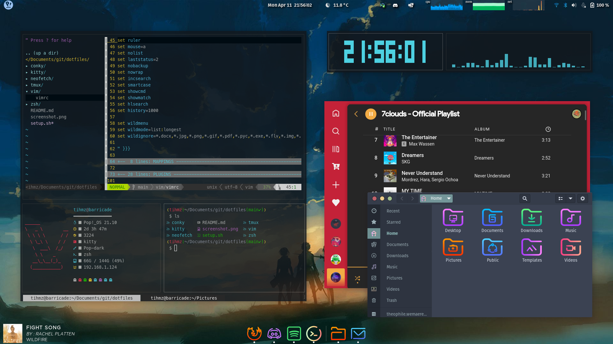

# dotfiles

The conky script is a modified "now-clocking" script found here 
https://www.omgubuntu.co.uk/2021/07/spotify-now-playing-conky-linux-widget

It support spotify and firefox (youtube), when nothing is playing it display basic system info (CPU,RAM...)

you can type
```
$ chmod +x setup.sh
$ ./setup.sh --all
```
that should install all the config file at the right place without deleting anything

*it should work (not sure)*

With popOS it give something that look like this:


